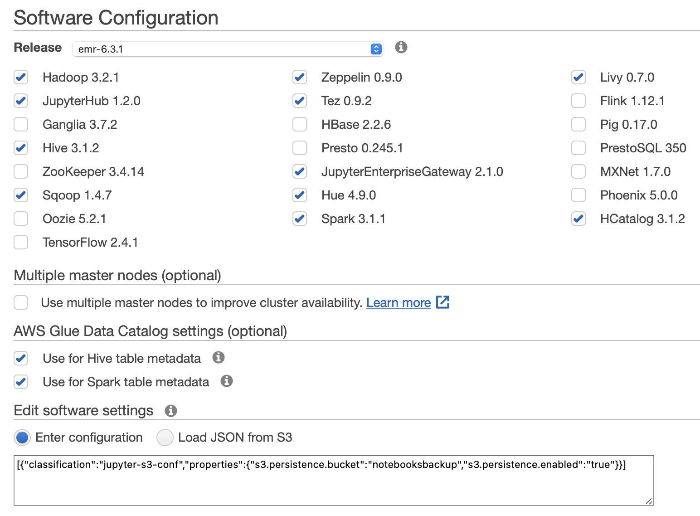
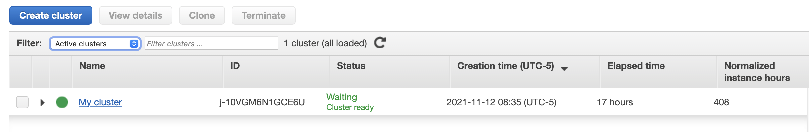

# Laboratorio 00 Big Data (EMR)

## En el presente laboratorio se creó un Cluster EMR en AWS

---

### :wrench: Configuración de software:

### :electric_plug: Nodos e instancias:

### :battery: Despues de aproximadamente 25 minutos el cluster será creado.

---

### :warning: Es importante revisar los inbounding rules, para verificar que los puerto que están usando cada uno de los servicios así como el puerto 22 para la conexión a ssh estén abiertos.

