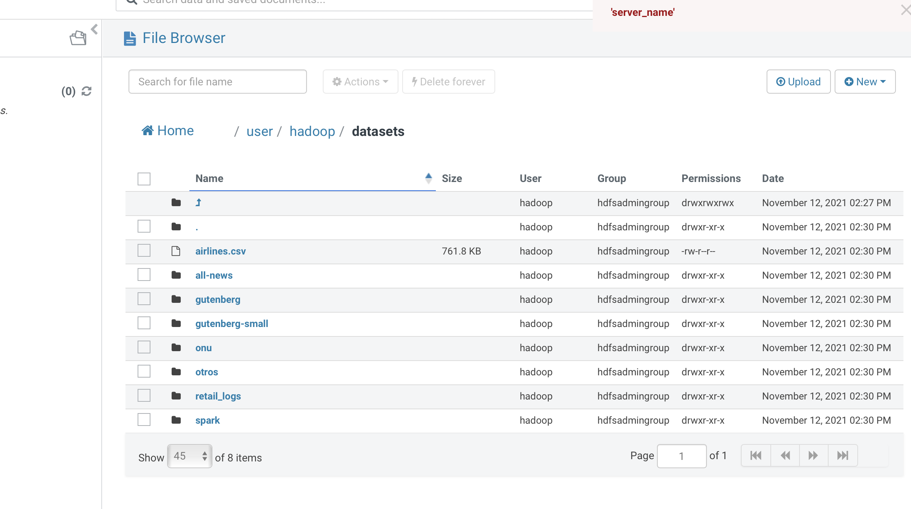
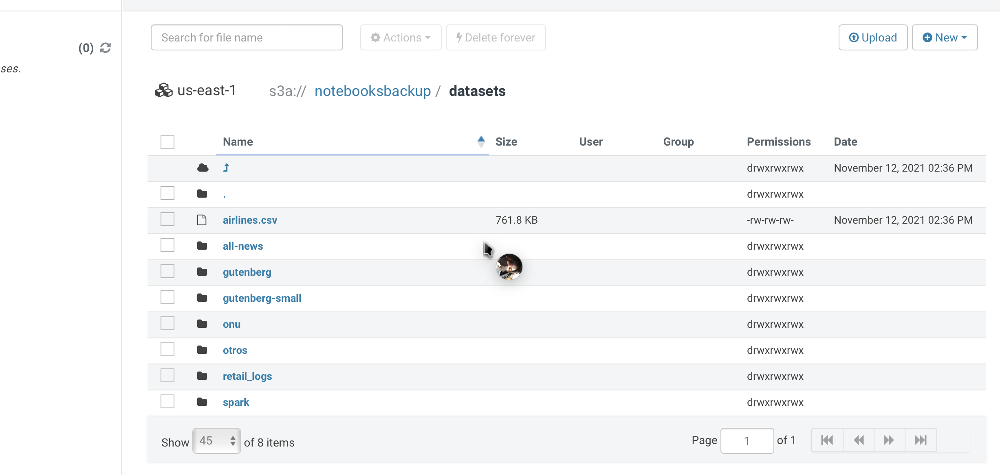

# Laboratorio 01 Big Data (Hadoop)

## En el presente laboratorio se hace copia de archivos locales a hadoop y se generará una persistencia de los mismos en S3.

---

### :warning: Requerimientos:

- [x] para este laboratorio es necesario ya tener el cluster corriendo en EMR, así como tambien una conexión ssh desde una terminal al master.

- [x] Es necesario clonar el repositorio con los datos a copiar dentro de la instancia del master.

- [x] Para un paso a paso mas detallado de la creación revisar este enlace:
      [ST0263 HDFS](https://github.com/ST0263/st0263-20212/tree/main/Big%20Data/01-hdfs)

### :file_folder: Archivos en Hadoop:

### :floppy_disk: Archivos en el bucket de S3:

