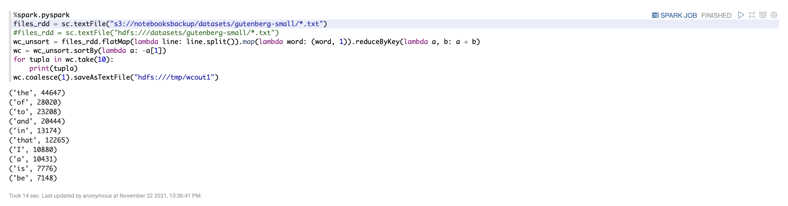
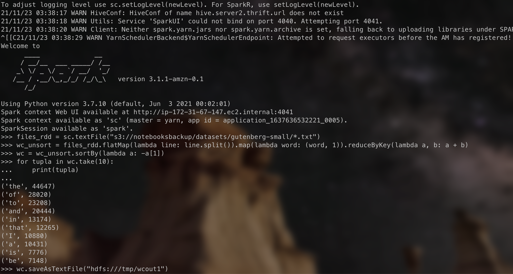
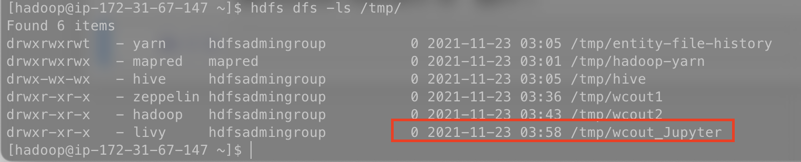

# Laboratorio 3.1 (PySpark)

## En el presente laboratorio se hará un ejemplo de procesamiento de datos con Spark, HDFS, Jupyter y S3 sobre un cluster EMR de AWS.

---

### :white_check_mark: Requerimientos:

- [x] Contar con un cluster EMR en AWS.
- [x] Contar con git instalado en el cluster, esto se puede hacer con el comando:

```bash
sudo jum install git
```

- [x] Clonar el siguiente repositorio dentro del master del cluster para tener acceso a los datos de prueba en HDFS: https://github.com/st0263eafit/st0263_20212.git

### :arrow_forward: Ejecución:

- [x] Accede a el directorio datasets en el repositorio clonado.
- [x] Ejecuta las siguientes instrucciones:

```bash
pyspark
```

```python
files_rdd = sc.textFile("hdfs:///datasets/gutenberg-small/*.txt")

files_rdd = sc.textFile("s3://st0263datasets/gutenberg-small/*.txt")
wc_unsort = files_rdd.flatMap(lambda line: line.split()).map(lambda word: (word, 1)).reduceByKey(lambda a, b: a + b)
wc = wc_unsort.sortBy(lambda a: -a[1])

for tupla in wc.take(10):
    print(tupla)

wc.saveAsTextFile("hdfs:///tmp/wcout1")

wc.coalesce(1).saveAsTextFile("hdfs:///tmp/wcout2")
```

### Salida en Jupyter:



### Salida en terminal de EMR:



- [x] Confirmamos que los datos fueron almacenados correctamente:
      
