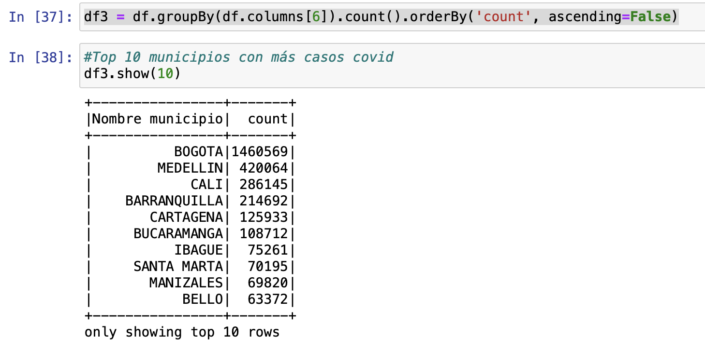
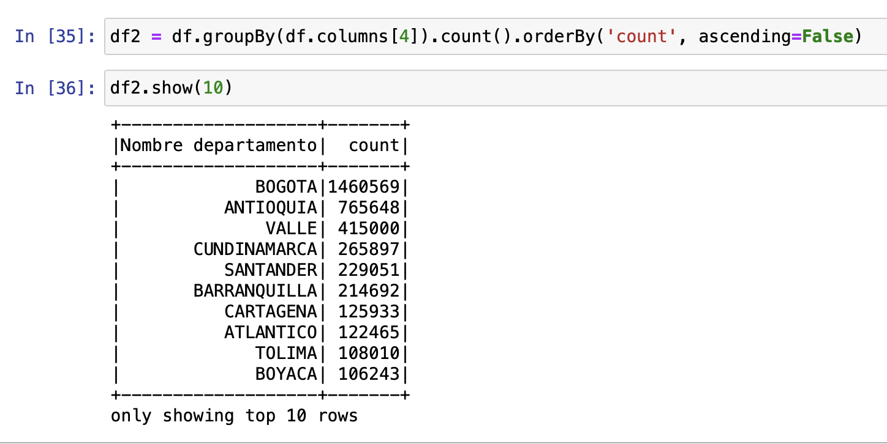
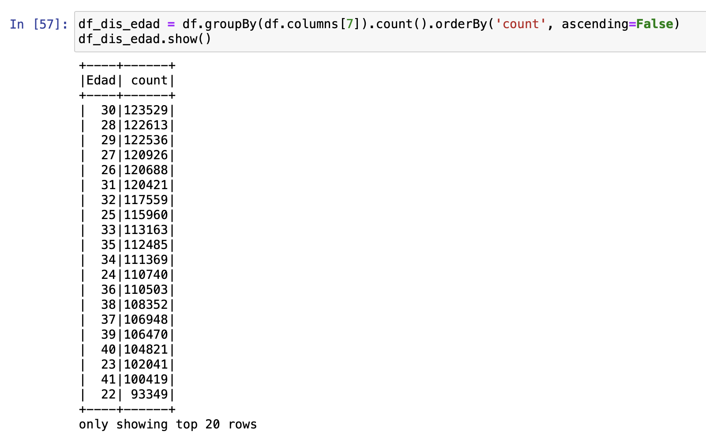
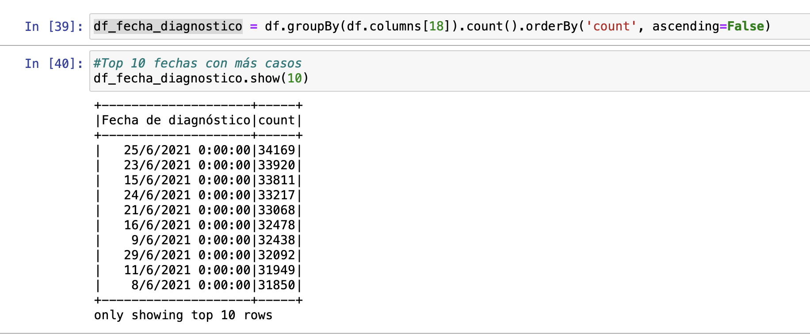
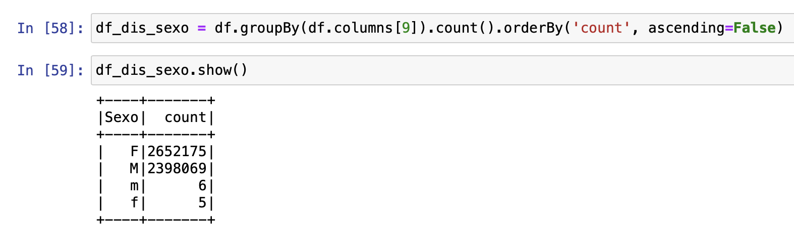
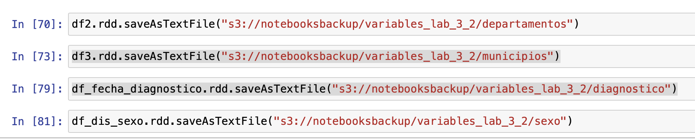
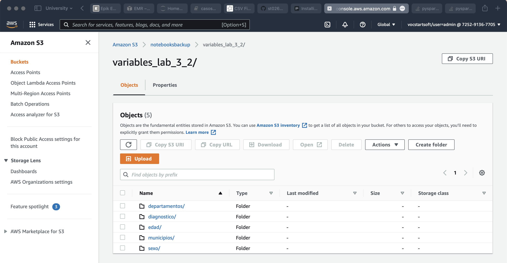

# Laboratorio 3.2 (PySpark - caso de uso)

## En el presente laboratorio se hará un caso de uso de consultas con spark en una base datos de casos de covid.

---

### :white_check_mark: Requerimientos:

- [x] Contar con un cluster EMR en AWS con Jupyter instalado.
- [x] contar con los datos de prueba en S3.

### :arrow_forward: Ejecución:

- [x] Accede a jupyter desde la instancia master de EMR.

### Las 10 ciudades con más contagios:

### Los 10 departamentos con más contagios:

### Casos de Covid por edad:

### Las 10 rechas con más registros de contagio:

### Numero de casos por sexo:

- [x] Almacenamos las variables creadas:

